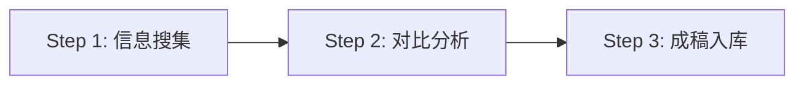

# 流水线剧本使用指南

> **版本**: 1.0  
> **更新日期**: 2026-08-27  
> **适用对象**: 平台管理员、租户管理员、普通用户

---

## 📋 什么是流水线剧本?

流水线剧本(Pipeline)是将**多步骤复杂任务**固化为可复用的执行模板。每个流水线包含:

1. **执行步骤(Steps)**: 按顺序执行的子任务,每个步骤可委派给不同的子 Agent
2. **异常处理(Exception Handling)**: 定义各步骤失败时的降级策略

与预设人格(Preset)的区别:
- **Preset**: 定义 Agent 的"人设"(你是谁,说话风格)
- **Pipeline**: 定义任务的"流程"(先做什么,后做什么,失败了怎么办)

---

## 🎯 内置流水线清单

### 1. 调研报告流水线 (`research-report`)

**作用域**: PLATFORM (全平台可用)  
**适用场景**: 需要撰写行业调研、竞品分析、技术选型报告

#### 执行流程



**Step 1: 信息搜集** (子 Agent: researcher)
- 围绕主题进行多轮搜索
- 收集不少于 5 个来源
- 记录出处链接
- 输出: 要点清单 + 来源列表
- 保存笔记: `research-{主题}-raw.md`

**Step 2: 对比分析** (子 Agent: researcher)
- 交叉验证要点清单
- 剔除孤证与冲突信息
- 输出: 结构化分析结论(含表格)
- 保存笔记: `research-{主题}-analysis.md`

**Step 3: 成稿入库** (子 Agent: writer)
- 按"结论先行 → 论据 → 建议"结构成稿
- 引用 Step 1 的来源
- 输出: 最终报告笔记 `research-{主题}-final.md`

#### 异常处理

| 异常情况 | 处理策略 |
|---------|---------|
| 来源不足 3 个 | 扩大关键词再搜一轮,仍不足则在报告中标注"资料有限" |
| 信息互相矛盾 | 保留双方观点并标注分歧,不擅自裁决 |

#### 使用示例

```bash
# 前端调用
POST /api/chat/stream
{
  "content": "帮我写一份关于 RAG 技术的调研报告",
  "pipelineCode": "research-report"
}
```

---

### 2. 长文写作流水线 (`doc-writing`)

**作用域**: PLATFORM (全平台可用)  
**适用场景**: 技术文档、产品说明书、博客文章

#### 执行流程

**Step 1: 大纲设计** (子 Agent: planner)
- 根据主题拆解章节结构
- 确定每章核心论点
- 输出: 三级大纲 (章→节→小节)
- 保存笔记: `doc-{主题}-outline.md`

**Step 2: 分章撰写** (子 Agent: writer)
- 按大纲逐章展开
- 每章不少于 800 字
- 插入代码示例/图表说明
- 保存笔记: `doc-{主题}-draft.md`

**Step 3: 润色校对** (子 Agent: editor)
- 检查逻辑连贯性
- 统一术语表达
- 修正语法错误
- 输出: 终稿笔记 `doc-{主题}-final.md`

#### 异常处理

| 异常情况 | 处理策略 |
|---------|---------|
| 某章内容不足 500 字 | 补充案例或扩展论述,仍不足则标注"待补充" |
| 术语前后不一致 | 建立术语表,全文统一替换 |

#### 使用示例

```bash
POST /api/chat/stream
{
  "content": "写一篇关于 Spring Boot 3 新特性的技术博客",
  "pipelineCode": "doc-writing"
}
```

---

### 3. 故障排查流水线 (`incident-diagnosis`)

**作用域**: PLATFORM (全平台可用)  
**适用场景**: 系统故障诊断、性能问题分析、线上事故复盘

#### 执行流程

**Step 1: 现象确认** (子 Agent: investigator)
- 收集故障现象(错误日志、监控指标、用户反馈)
- 确认影响范围(哪些服务/用户受影响)
- 输出: 故障现象清单
- 保存笔记: `incident-{时间}-symptoms.md`

**Step 2: 根因分析** (子 Agent: analyst)
- 根据现象推测可能原因
- 逐一验证假设(查日志、看配置、比对变更)
- 定位根本原因
- 输出: 根因分析报告
- 保存笔记: `incident-{时间}-rootcause.md`

**Step 3: 修复方案** (子 Agent: solver)
- 制定短期应急措施(快速恢复服务)
- 制定长期根治方案(防止复发)
- 评估修复风险
- 输出: 修复方案文档
- 保存笔记: `incident-{时间}-solution.md`

#### 异常处理

| 异常情况 | 处理策略 |
|---------|---------|
| 无法定位根因 | 列出 Top 3 可疑点,建议人工介入排查 |
| 修复方案有风险 | 提供回滚预案,标注风险等级 |

#### 使用示例

```bash
POST /api/chat/stream
{
  "content": "线上订单服务响应超时,请帮我排查原因",
  "pipelineCode": "incident-diagnosis"
}
```

---

## 🔧 如何创建自定义流水线?

### 方法 1: 通过前端界面 (推荐)

1. 登录平台,进入「平台治理 → 流水线管理」
2. 点击「新增流水线」
3. 填写表单:
   - **流水线编码**: 唯一标识,如 `code-review-pipeline`
   - **流水线名称**: 中文名称,如 "代码审查流水线"
   - **作用域**: 
     - PLATFORM: 全平台可见 (仅平台管理员可创建)
     - TENANT: 本租户可见 (租户管理员可创建)
     - USER: 仅自己可见 (普通用户可创建)
   - **执行步骤**: Markdown 格式,参考上述示例
   - **异常处理**: Markdown 格式,定义各步骤失败时的降级策略
4. 点击「保存」

### 方法 2: 通过 API

```bash
POST /api/admin/pipeline
Content-Type: application/json
Authorization: Bearer <JWT_TOKEN>

{
  "pipelineCode": "code-review-pipeline",
  "pipelineName": "代码审查流水线",
  "scope": "TENANT",
  "steps": "## 执行步骤\n### Step 1: 静态检查\n...\n### Step 2: 逻辑审查\n...",
  "exceptionHandling": "## 异常处理\n- 检查工具未安装 → 跳过该步骤,在报告中注明",
  "enabled": 1,
  "displayOrder": 10
}
```

---

## 💡 最佳实践

### 1. 步骤设计原则

✅ **原子性**: 每个步骤只做一件事,职责单一  
✅ **可委托**: 明确指定子 Agent 角色 (researcher/writer/editor 等)  
✅ **有产出**: 每个步骤必须有明确的输出物 (笔记/报告/清单)  
✅ **可回溯**: 保存中间产物到工作区,便于调试和优化

❌ **避免**: 
- 步骤过于笼统 ("分析问题" → 应拆分为"收集信息"、"对比分析"、"得出结论")
- 步骤间强耦合 (Step 2 依赖 Step 1 的具体实现细节)
- 缺少异常处理 (未定义失败时的降级策略)

### 2. 命名规范

- **编码**: 小写字母 + 连字符,如 `data-analysis-pipeline`
- **名称**: 简洁明了,突出核心价值,如 "数据分析流水线"
- **笔记文件**: `{类型}-{主题}-{阶段}.md`,如 `research-AI-trends-raw.md`

### 3. 作用域选择

| 场景 | 推荐作用域 | 示例 |
|------|-----------|------|
| 通用任务模板 | PLATFORM | 调研报告、长文写作、故障排查 |
| 团队专属流程 | TENANT | 代码审查、需求评审、发布检查 |
| 个人工作流 | USER | 每日总结、学习笔记、待办整理 |

### 4. 异常处理策略

**常见降级模式**:
- **重试**: "网络请求失败 → 重试 3 次,仍失败则标注'数据获取失败'"
- **跳过**: "某步骤工具未安装 → 跳过该步骤,在最终报告中标注"
- **人工介入**: "无法自动决策 → 列出选项,等待用户确认"
- **部分完成**: "数据不足 → 基于现有信息给出初步结论,标注'资料有限'"

---

## 📊 流水线效果监控

### 查看执行历史

1. 进入「对话历史」页面
2. 筛选条件选择「使用流水线」
3. 查看每次执行的:
   - 总耗时
   - 生成的笔记文件
   - 是否触发异常处理

### 优化迭代

根据执行结果持续优化:
1. **步骤调整**: 合并冗余步骤,拆分复杂步骤
2. **异常完善**: 补充新的异常场景和处理策略
3. **角色优化**: 调整子 Agent 分工,提升效率

---

## ❓ 常见问题

### Q1: 流水线和预设可以同时使用吗?

**可以**。两者正交:
- `presetCode`: 定义 Agent 的人设(语气、专业领域)
- `pipelineCode`: 定义任务的执行流程

示例:
```json
{
  "content": "帮我调研 AI 编程助手",
  "presetCode": "tech-expert",  // 技术专家人设
  "pipelineCode": "research-report"  // 调研报告流程
}
```

### Q2: 流水线执行失败会影响对话吗?

**不会**。流水线只是提示词层面的引导,即使某步骤未按预期执行,Agent 仍会尽力完成后续步骤。异常处理策略主要用于指导 Agent 的降级行为。

### Q3: 如何调试流水线?

1. **查看笔记文件**: 每个步骤的输出都会保存到 `D:/claw-agent/.agentscope/workspace/knowledge/` 目录
2. **检查工作区**: 进入工作区目录,查看生成的 Markdown 文件
3. **逐步执行**: 先在单步测试,确认无误后再串联成完整流水线

### Q4: 流水线可以嵌套吗?

**当前不支持**。流水线是扁平的步骤列表,不能在一个步骤中调用另一个流水线。如需复杂编排,建议在单个步骤内通过子 Agent 实现。

---

## 🔗 相关文档

- [平台定义文档](PLATFORM_DEFINITION.md) - 完整的 API 规范
- [动态工具注册系统](DYNAMIC_TOOL_REGISTRY.md) - 工具集管理
- [AgentScope 工作区](https://agentscope.io/docs/workspace) - 官方文档

---

**文档维护者**: Claw Agent Team  
**最后更新**: 2026-08-27  
**反馈渠道**: GitHub Issues
